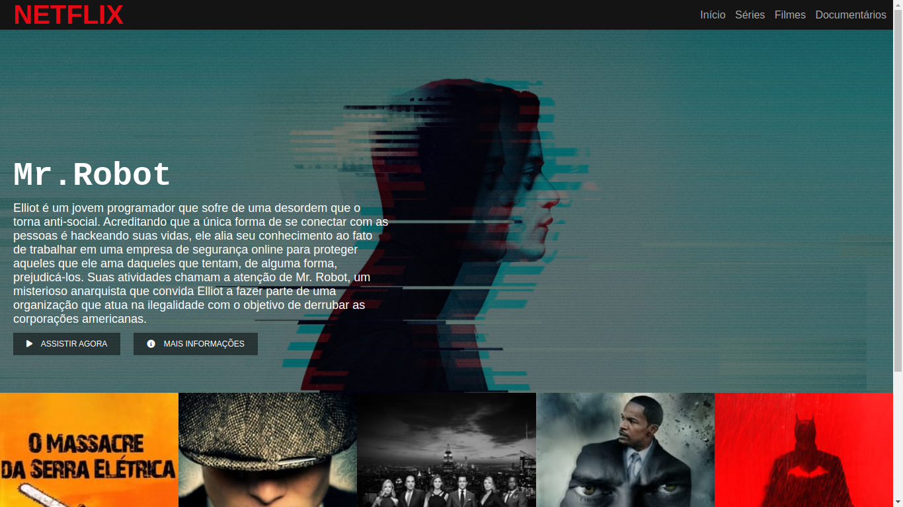
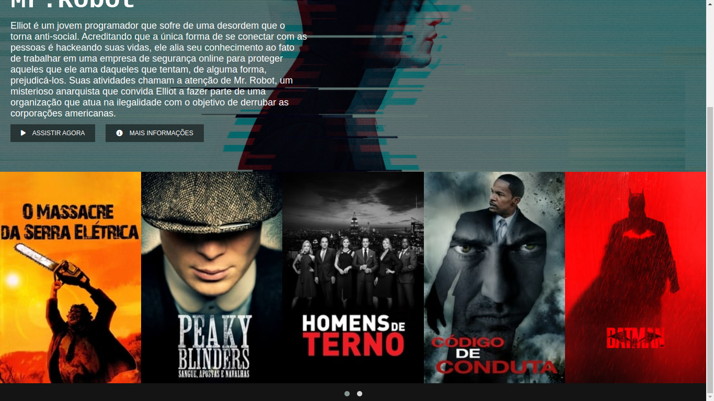

<h1 align="center">netflixClone<h1>
<h5>Recriação da interface do site de streaming mundial utilizando tecnologias simples como HTML5, CSS3 e JavaScript. Neste projeto eu consolidei mais ainda meus conhecimentos de como estruturar um layout, técnicas de CSS3 com containers e variáveis, como posicionar os elementos com Flexbox e como utilizar plugins JQuery a favor desta aplicação.<h4>

  <a href="https://github.com/Victor160197">
  
  

  
 ## Links:
  
 ### Plugins JQuery Owl Carousel 2 : 
  https://owlcarousel2.github.io/OwlCarousel2/
  
  ### Fontawesome:
  
  https://fontawesome.com/
  
  
  
